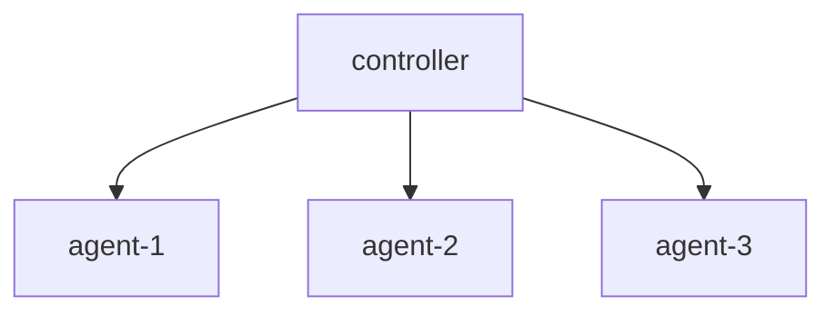

# UZI

Minimalistic distributed load test system

## Define plan

```kotlin
import kotlin.time.Duration.Companion.milliseconds

val MyExecutionPlan = uzi {
    parallel {
        repeat(10) {
            http {
                frequency {
                    normal(mean = 1.seconds, deviation = 100.milliseconds)
                }

                request {
                    uri = "https://google.com"
                }
            }
        }

        http {
            frequency {
monothone(every = 500.milliseconds)
            }
            
            request {
                uri = "https://google.com"
            }
        }
    }

    http {
        frequency {
            once() 
        }

        request {
            uri = "https://google.com"
        }
    }
}
```

## Distributed model

Controller evenly distributes work between agents

